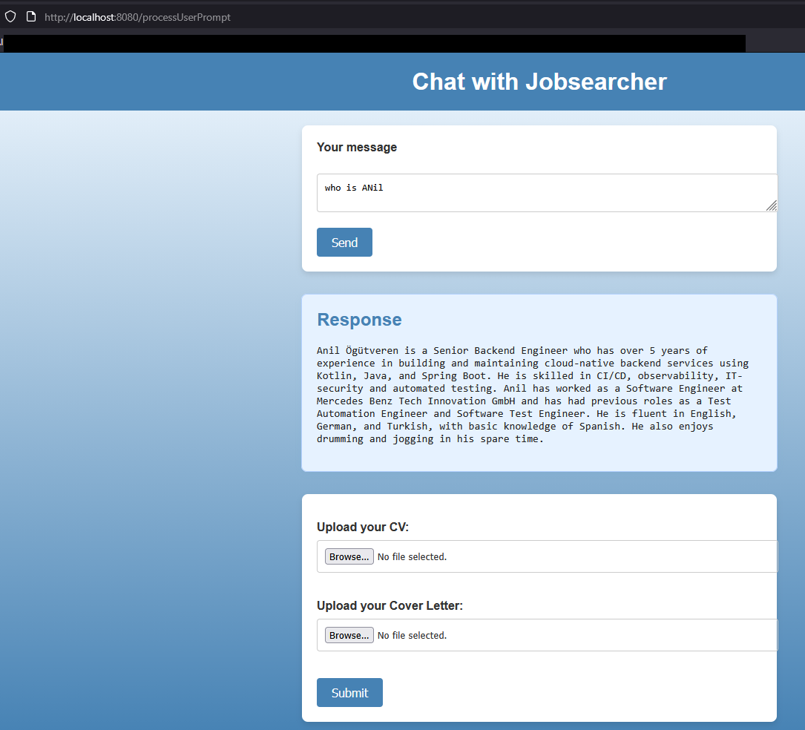

# Getting Started

### Introduction
This project is a Spring Boot application that leverages Gradle as its build tool. It integrates various dependencies to provide functionalities such as AI capabilities, web services, and database interactions.

This app uses RAG for ingesting Cv file into vector database and uses OpenAI to answer questions based on the ingested data.
This app uses ToolCalling for ingesting cover letter file and uses OpenAI to answer questions based on the ingested data.

### Prerequisites
Before you begin, ensure you have met the following environment variables for docker compose run configuration as shown in the image below:

### Guides
The following guides illustrate how to use some features concretely:

After starting the app, open localhost:8080/chat in your browser to access the web interface.
You can upload your CV and Cover Letter files using the provided form. Once uploaded, you can ask questions related to the content of these documents.
You can search for a job in your wished location using the job search chat.

#### Local Development
To run the application locally using Docker Compose, follow these steps:
Run the Llama3.2 model on docker desktop model runnner
open the port
docker desktop enable model-runner --tcp=12434

Than test it with the following curl command:
curl http://localhost:12434/engines/llama.cpp/v1/chat/completions \  -H "Content-Type: application/json" \  -d '{    "model": "ai/llama3.2:latest",    "messages": [      {"role": "user", "content": "Tell me about Docker Model Runner."}    ]  }'

### Reference Documentation
For further reference, please consider the following sections:

* [Official Gradle documentation](https://docs.gradle.org)
* [Spring Boot Gradle Plugin Reference Guide](https://docs.spring.io/spring-boot/3.5.6/gradle-plugin)
* [Create an OCI image](https://docs.spring.io/spring-boot/3.5.6/gradle-plugin/packaging-oci-image.html)
* [Tika Document Reader](https://docs.spring.io/spring-ai/reference/api/etl-pipeline.html#_tika_docx_pptx_html)
* [OpenAI](https://docs.spring.io/spring-ai/reference/api/chat/openai-chat.html)
* [Spring Web](https://docs.spring.io/spring-boot/3.5.6/reference/web/servlet.html)
* [PGvector Vector Database](https://docs.spring.io/spring-ai/reference/api/vectordbs/pgvector.html)

